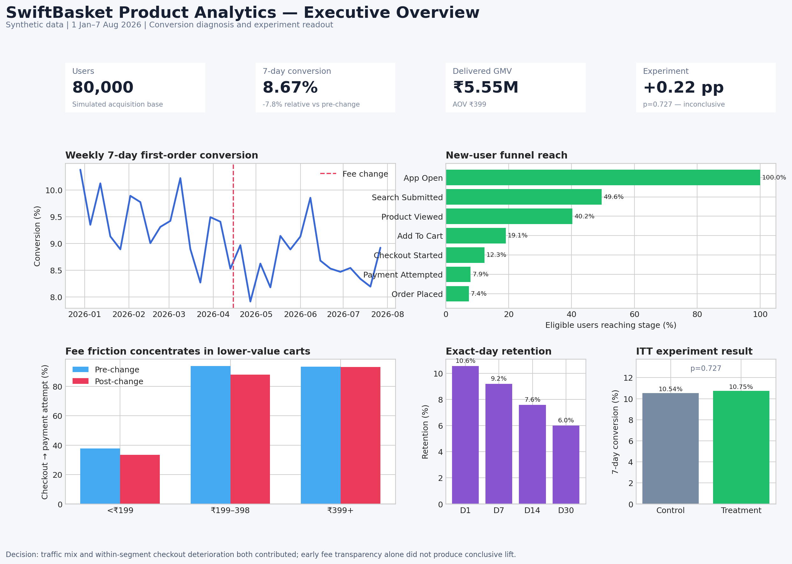

# SwiftBasket Product Analytics

An end-to-end quick-commerce product analytics case study covering event instrumentation, advanced SQL, funnel and retention analysis, root-cause decomposition, unit economics, and experimentation.

> **Synthetic-data disclosure:** SwiftBasket is fictional. All users, stores, products, events, orders, payments, experiment assignments, and results are simulated in Python. This repository does not contain or claim access to any company’s proprietary data.



## Business problem

New-user acquisition remained healthy, but seven-day first-order conversion declined after mid-April. The Product Manager asked:

- Where in the user journey did the decline occur?
- Was it caused by a lower-quality acquisition mix, product friction, or both?
- Which segments were most affected?
- What product change should be tested without damaging retention or unit economics?

The simulated scenario introduces two simultaneous changes: Meta Ads gains a larger share of acquisition and a revised handling fee is disclosed late in checkout. Latent purchase intent and price sensitivity influence generation but are deliberately excluded from the analytical tables.

## Dataset

| Entity | Rows |
|---|---:|
| Users | 80,000 |
| Sessions | 193,269 |
| Behavioral events | 913,788 |
| Checkout attempts | 25,690 |
| Orders | 14,895 |
| Stores | 15 |
| Products | 600 |

Generation is deterministic with `random_seed: 42`. The full dataset is not committed because it is reproducible and large; the repository contains sample files and the generator.

## Product measurement framework

**North Star:** weekly successful orders—orders delivered without complete failure or cancellation.

**Primary problem metric:** eligible new users completing a delivered first order within seven days of first app open.

**Primary KPIs:** ordered funnel conversion, checkout-to-payment attempt, payment success, seven-day first-order conversion, repeat purchase, GMV and AOV.

**Guardrails:** cancellation, refunds, D7/D30 retention, contribution margin per delivered order and payment failure.

## Verified results

### 1. Conversion decline

- Seven-day delivered first-order conversion declined from **9.40% to 8.67%**.
- This equals **−0.73 percentage points** or **−7.8% relative**.

### 2. Root-cause decomposition

- Acquisition-channel mix explains approximately **−0.33 percentage points**.
- Within-channel conversion deterioration explains approximately **−0.40 percentage points**.
- Meta Ads’ acquisition share rose from **18.3% to 30.1%**, while its post-change conversion was **6.53%**.
- The mix shift matters, but it does not fully explain the decline.

### 3. Checkout localization

Upstream product interest remained present, while the largest diagnostic change appeared between checkout and payment:

| Cart value | Pre-change payment-attempt rate | Post-change rate | Change |
|---|---:|---:|---:|
| Below ₹199 | 37.76% | 33.37% | −4.39 pp |
| ₹199–₹398 | 93.86% | 87.88% | −5.97 pp |
| ₹399+ | 93.34% | 93.17% | −0.17 pp |

The near-zero change above ₹399, where handling fees are waived, supports fee friction as the main within-segment diagnosis.

### 4. Retention and monetization

- D1/D7/D14/D30 exact-day retention: **10.56% / 9.19% / 7.59% / 6.01%**.
- Delivered GMV: **₹5.55M** across **13,916 delivered orders**.
- AOV: **₹398.65**.
- Repeat purchase rate among delivered-order buyers: **12.34%**.
- Estimated contribution margin per delivered order: **₹81.43**.

## Experiment: early fee transparency

Eligible July users were randomized before exposure:

- **Control:** handling fee first appears during checkout.
- **Treatment:** handling fee and estimated payable amount appear in the cart.
- **Primary metric:** order placement within seven days of assignment, analyzed by intent-to-treat.

| Variant | Assigned | 7-day conversion |
|---|---:|---:|
| Control | 4,916 | 10.54% |
| Treatment | 4,891 | 10.75% |

Observed effect: **+0.22 percentage points / +2.1% relative**, but **p=0.727** and the 95% confidence interval for the absolute difference is **−1.00 to +1.44 points**. The result is statistically and practically inconclusive. Approximately 15.4K users per arm would be required to detect a one-point absolute lift with 80% power under similar baseline conversion.

**Decision:** do not claim conversion improvement. Continue the test only if a one-point minimum detectable effect is decision-relevant; separately test the fee amount or waiver because transparency alone may move the location of abandonment without changing purchase economics.

## Recommendations

| Priority | Recommendation | Rationale | Primary metric | Guardrail |
|---:|---|---|---|---|
| 1 | Test a first-order handling-fee waiver for carts below ₹399 | Low-value carts show the largest deterioration | Seven-day first-order conversion | Contribution margin/order |
| 2 | Keep fee transparency separate from financial incentives | Isolates UI trust from price effects | Cart-to-order conversion | AOV, support contacts |
| 3 | Tighten Meta Ads targeting and evaluate incrementality | Channel share rose while conversion remained lowest | Converted users per ₹ acquisition cost | Acquisition volume |
| 4 | Monitor checkout by cart band and user type | Aggregate conversion hides concentrated friction | Checkout-to-payment rate | Payment success |

See [`insights/product_recommendations.md`](insights/product_recommendations.md) for prioritization and trade-offs.

## Technical approach

- **Python:** causal data-generation pipeline, latent behavioral variables, validation, statistical testing and dashboard export.
- **PostgreSQL:** relational schema, ordered event funnel, cohorts, segmentation, window functions, conditional aggregation, monetization and experiment readout.
- **Analytics methods:** cohort maturity, channel decomposition, root-cause localization, intent-to-treat and confidence intervals.

## Repository structure

```text
config/                 Generator assumptions
src/generator/           Reproducible synthetic-data pipeline
src/analyze.py           Verified metric and experiment analysis
sql/                     PostgreSQL schema and analytical queries
data/samples/            Small portfolio-safe sample tables
data/data_dictionary/    Field and event definitions
data/analysis_outputs/   Dashboard-ready verified aggregates
dashboard/               Dashboard builder and screenshot
insights/                Root cause, experiment and recommendations
notebooks/               Guided analysis walkthrough
```

## Run locally

```bash
python -m venv .venv
.venv\Scripts\activate
pip install -r requirements.txt
python -m src.generator.generate
python -m src.analyze
python dashboard/build_dashboard.py
```

PostgreSQL users can create the schema with `sql/01_create_schema.sql`, bulk-load the generated tables, and run the analysis files in numeric order.

## Interview assets

- [`insights/root_cause_summary.md`](insights/root_cause_summary.md)
- [`insights/experiment_readout.md`](insights/experiment_readout.md)
- [`insights/interview_walkthrough.md`](insights/interview_walkthrough.md)
- [`insights/resume_positioning.md`](insights/resume_positioning.md)
